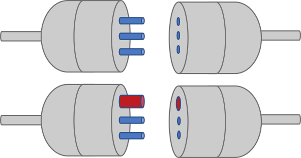

# Code Under Fire

Was Software-Teams von der Feuerwehr über Führung, Resilienz und Incident Management lernen können

Philipp Jardas

---
layout: image
image: /0300.jpeg
class: text-center
---

# 03:00 Uhr nachts

Das Telefon klingelt.

---
layout: image
image: /split.jpeg
---

### Philipp Jardas

**Lead Software Engineer**  

Cloud-native full-stack enthusiast

TypeScript + React + AWS = ❤️

Startup Culture, Lean Product Development, Speedboat Unit Captain

Trainer Gewaltfreie Kommunikation, Meetup Host, Speaker

### Philipp Jardas

**Hauptfeuerwehrmann**  
**Freiw. Feuerwehr Gelnhausen**

Atemschutzgeräteträger, Drohnenpilot, TEL, ELW2-Besatzung

knapp 200 Einsätze im Jahr

---
layout: image-right
image: /durchatmen.jpeg
---

# Kognitiver Tunnelfokus

- Stress + Adrenalin = Logik kaputt
- Kein Fehler. Das ist das Tier in uns.
- In diesem Zustand triffst du keine guten Entscheidungen.
- Aber: Das Nervensystem lässt sich beeinflussen durch bewusste Atmung. Runterkommen. Achtsamkeit.

> ### Feuerwehrleute rennen nicht
>
> Slow is smooth, smooth is fast.

---
layout: image
image: /huddle.jpeg
---

Prinzip 1

# Die 10-for-10 Regel

**Taktik aus Feuerwehr und Rettungsdienst**

10 Sekunden Huddle für die nächsten 10 Minuten Fokus.

Erst die Lage erkunden, dann handeln.

---
layout: image
image: /auftrag.jpeg
---

Prinzip 2

# Auftragstaktik

**Führung über Ziele und Ressourcen**

Der Einsatzleiter sagt nicht **WIE**, sondern **WAS**.

> **"Angriffstrupp zur Brandbekämpfung mit dem 1. Rohr ins 2. OG vor!"**

Nicht: "Halte den Schlauch 30 Grad nach links."

Wichtig: Selbstständige Meldungen nach oben.

---

Prinzip 3

# Idiotensicheres Tooling

Poka-Yoke: Geräte funktionieren bei Nullsicht und mit dicken Handschuhen.

**Keep It Simple for Disaster.**

Notfall-Tools und Failovers als "Big Red Button" bauen.

Für dein übermüdetes 3-Uhr-nachts-Ich.

---
layout: image
image: /riegelstellung.jpeg
---

Prinzip 4

# Brandabschnitte

**Proaktiv Domino-Effekte vermeiden**

Vorbeugender Brandschutz unterteilt große Gebäude in Brandabschnitte zur passiven Verzögerung der Brand- und Rauchausbreitung.

Aktive Variante: Riegelstellung schützt Nachbargebäude, wo die Architektur es nicht tut. Brandschneisen verhindern die Ausbreitung von Vegetationsbränden.

### Software

Passiv: Bulkheads, Circuit Breakers.

Aktiv: Kill-Switch, Traffic umleiten, Pod/Node abschießen.

---
layout: image-right
image: /danach.jpeg
---

Prinzip 5

# Nach dem Einsatz ist vor dem Einsatz

**Einsatzbereitschaft ist keine Kür**

Schläuche rollen, Flaschen tauschen, Material auffüllen. Sofort, nicht irgendwann. Der nächste Einsatz kommt, bevor du fertig bist.

Software: Feature-Flags zurücksetzen, Hotfixes nachziehen, Monitoring wiederherstellen, Debug-Code aufräumen. Provisorien aus dem Incident sind keine Backlog-Tickets für später.

---
layout: image
image: /grossuebung.jpeg
class: grid items-center
---

Prinzip 6

# Erfahrung sammeln

**Drills unter möglichst echten Bedingungen**

Prozesse aus der Theorie in die Praxis holen. Muskelgedächtnis trainieren. Schwachstellen aufdecken. Kommunikation verbessern. Team-Zusammenhalt stärken.

Gewöhnung führt zu Ruhe und Gelassenheit.

### In der Software

Chaos Engineering, GameDays, Incident-Simulationen.

Regelmäßig, nicht erst nach dem ersten echten Ausfall.

> **Wenn eine Übung gut lief, war sie zu einfach.**

---
layout: image-right
image: /nachbesprechung.jpeg
---

Prinzip 7

# Einsatz-Nachbesprechung

**Aus Fehlern lernen statt Schuldige suchen**

Was ist passiert? Was lief gut? Wo versagen Technik, Prozesse oder menschliche Fähigkeiten? Wo brauchen wir mehr Ausbildung? Wie verbessern wir unsere Prozesse? Wo liegen unsere Stärken, wo unsere Schwächen?

Blameless Post-Mortems erfordern psychologische Sicherheit und konstruktive Fehlerkultur.

Resilienz wächst aus Ehrlichkeit, nicht aus Angst.

---
layout: center
class: text-center
---

# Zusammenfassung

#### 1. Innehalten statt Hektik

Durchatmen. Ruhe ausstrahlen. Erst erkunden, dann handeln. 10-for-10.

#### 2. Autonomie stärken

Auftragstaktik: Ziel vorgeben, Ausführung freigeben. Selbstständige Meldungen.

#### 3. Notfall-Tools vereinfachen

KISD: der Big Red Button für 3 Uhr nachts.

#### 4. Proaktive Resilienz

Passive Maßnahmen einbauen. Schadenbegrenzung durch Eindämmen.

#### 5. Nach dem Einsatz…

Sofort aufräumen statt aufschieben.

#### 6. Der ewige Kreis

Unter echten Bedingungen üben. Blameless Post-Mortems.

---
layout: image
image: /sunset.jpeg
---

# Vielen Dank!

**Slides**

<QRCode :width="250" :height="250" :margin="0" type="svg" data="https://talks.jardas.de/code-under-fire/" />

talks.jardas.de/code-under-fire/

  
  

    
Digitale Souveränität

    
Architektur für eine ungewisse Zukunft

  

  
  

    
10x produktiver, 10x erschöpfter

    
Wie wir die Ära des agentischen Codens überleben

  

